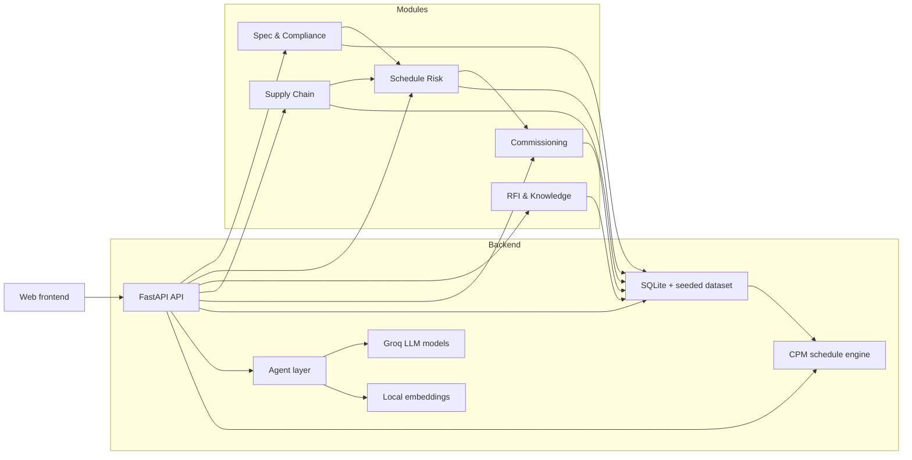

# SiteMind — AI Intelligence Platform for Data Centre EPC Delivery

SiteMind unifies specifications, schedules, procurement, quality records and RFIs
for a hyperscale data-centre build into one shared intelligence layer. The project
is a hackathon prototype built on a synthetic but internally consistent dataset
(Project Meghdoot — a 24 MW campus in Navi Mumbai, Phase 1 = one 8 MW data hall).

## What it does

SiteMind combines deterministic analysis with agent-driven intelligence to support:

- spec compliance review and NCR generation
- schedule risk forecasting and CPM-based impact analysis
- RFI retrieval and answer drafting with source citation
- supply chain visibility for critical shipments
- commissioning validation and test-blocking logic

The core value is cross-module coordination: compliance findings can raise schedule
risks, shipment slips can affect the schedule, and open risks can block commissioning.

## Highlights

| Metric | Outcome | Notes |
|---|---|---|
| Compliance detection | Precision 100%, Recall 100%, F1 100% | Measured against 9 submittals with 10 labelled deviations in `canonical.py`. |
| Schedule risk lead time | Flagged ~6 weeks before impact | CPM what-if verifies the predicted 18-day critical-path delay. |
| RFI deflection | Similar prior RFI retrieved at >80% similarity | Auto-drafted answer generation with source-backed retrieval. |
| Review effort | Minutes per submittal | Displayed as a live “hours saved” KPI. |

## Architecture

The backend is built around a small deterministic spine and a lightweight agent layer.
The schedule engine is deterministic CPM, while the intelligence layer uses structured
LLM output and local embedding search.

Key features:

- cross-module hooks for compliance, supply and commissioning
- simulation clock for week-by-week risk progression
- knowledge graph view from relational entities to typed edges
- seeded dataset with reproducible demo results



## Stack

| Layer | Choice |
|---|---|
| LLM | Groq — `llama-3.3-70b-versatile` (agents) + `llama-3.1-8b-instant` (fast) |
| Structured output | JSON-mode + Pydantic validation (`llm.complete_json`) |
| Agent loop | OpenAI-style function-calling loop (`llm.run_agent`) |
| Embeddings | Local `fastembed` `bge-small-en-v1.5` (384-dim) |
| Vector store | SQLite + float32 BLOBs + numpy cosine search |
| Scheduling | `networkx` CPM (forward/backward pass, float arithmetic) |
| API | FastAPI + SSE streaming |
| Frontend | React + TypeScript + Vite + Tailwind v4 |

## Run it

1. Install backend dependencies

```bash
cd api
uv venv --python 3.13 && uv pip install -r requirements.txt
# or: python -m venv .venv && .venv/Scripts/pip install -r requirements.txt
```

2. Create `.env`

Copy `.env.example` to `.env` at the repository root and set `GROQ_API_KEY`.

3. Seed the database

```bash
.venv/Scripts/python -m sitemind.seed
```

4. Start the backend

```bash
.venv/Scripts/python -m uvicorn sitemind.main:app --host 127.0.0.1 --port 8141
```

5. Start the frontend in a separate terminal

```bash
cd web
npm install
npm run dev
```

Open `http://localhost:5175`.

For a zero-build fallback, the API page is available at `http://127.0.0.1:8141`.

## Project layout

```text
api/sitemind/
  config.py     llm.py         embeddings.py  db.py          repository.py
  cpm.py        crossmodule.py canonical.py   docgen.py      ingest.py
  seed.py       schemas.py     agents/        main.py        static/index.html
```

The seeded dataset in `canonical.py` is the source of truth for the demo metrics and
cross-module behavior.
